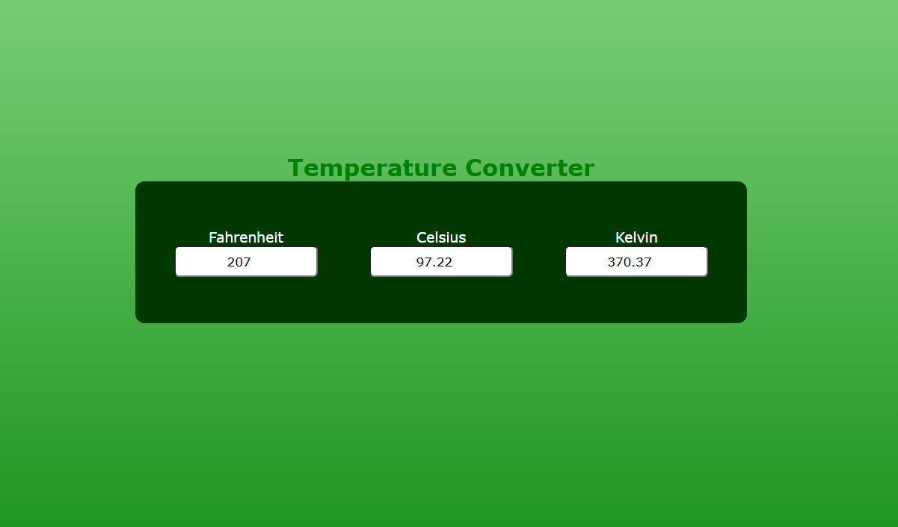

# 🌡️ Temperature Converter  

A sleek and responsive web app to convert temperatures between **Celsius**, **Fahrenheit**, and **Kelvin** in real-time. Built with pure **HTML**, **CSS**, and **JavaScript**—no frameworks, no fuss!  

📁 [View Source on GitHub](https://github.com/hardikagarwal2026/temperature_converter)  

---

## 🔥 Features  

- Convert between Celsius, Fahrenheit, and Kelvin instantly.  
- Clean, modern UI with a gradient background and centered layout.  
- Fully responsive on all screen sizes.  
- Built using only HTML, CSS, and JavaScript.  

---

## 📸 Screenshots  

  

---

## 💻 How It Works  

Each temperature field is synced with JavaScript logic. When you input a value in any one field, the other two update automatically using the correct conversion formulas:  

- **Celsius to Fahrenheit:** `(°C × 9/5) + 32`  
- **Celsius to Kelvin:** `°C + 273.15`  
- **Fahrenheit to Celsius:** `(°F − 32) × 5/9`  
- **Fahrenheit to Kelvin:** `((°F − 32) × 5/9) + 273.15`  
- **Kelvin to Celsius:** `K − 273.15`  
- **Kelvin to Fahrenheit:** `(K − 273.15) × 9/5 + 32`  

---

## 🛠️ Installation  

Want to run this locally?  

```bash
# Clone the repository  
git clone https://github.com/hardikagarwal2026/temperature_converter.git  

# Open index.html in your browser  
cd temperature_converter  
open index.html  
```  

Or simply drag and drop `index.html` into your browser.  

---

## 📁 Project Structure  

```
temperature_converter/  
├── index.html       # Main HTML file  
├── README.md          
└── screenshot.png   # UI preview  
```

---

## 🤝 Contributing  

Contributions are welcome! If you have ideas to improve this converter or want to make it more feature-rich, feel free to open an issue or submit a pull request.  

---

## 👋 Connect  

Created with ❤️ by [Hardik Agarwal](https://github.com/hardikagarwal2026)  
